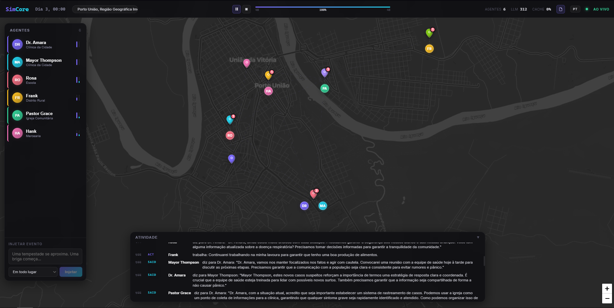

<h1 align="center">SimCore</h1>

<p align="center">
  <strong>Social simulation engine with autonomous LLM agents — running on a real map of your city</strong>
</p>

<p align="center">
  <a href="#quick-start">Quick Start</a> &bull;
  <a href="#scenarios">Scenarios</a> &bull;
  <a href="#how-it-works">How It Works</a> &bull;
  <a href="#configuration">Configuration</a> &bull;
  <a href="#llm-providers">LLM Providers</a>
</p>

<p align="center">
  
  
  
  
</p>

---

> **"Town Square" becomes the actual square in your city. "Park" becomes a real park nearby. Every simulation is anchored to a real place — making emergent stories feel personal.**

SimCore runs autonomous agents with memories, personalities, and goals inside a scenario you define. The dashboard renders everything on a live map pulled from OpenStreetMap, centered on wherever you are. Watch a disease outbreak unfold on the streets you know. Watch market dynamics play out in real locations.

---

<!-- Replace with actual screenshot/GIF -->


---

## Quick Start

```bash
git clone https://github.com/elisonfrank/simcore
cd simcore
pip install -e ".[dev]"

# Start the frontend
cd dashboard && npm install && npm run dev &

# Run a demo (no API key needed)
cd ..
python -m simcore.cli run scenarios/epidemic/config.yaml --dashboard --demo --speed 3.0 --port 8420
```

Open `http://localhost:5173` — the dashboard asks for your location, then resolves scenario places to real POIs near you.

---

## What Makes It Different

Most agent simulations run on abstract grids. SimCore runs on the real world:

- **Real map** — Leaflet + CartoDB dark tiles, centered on your city via geolocation
- **Real places** — scenario locations (Town Square, Park, Hospital) are matched to actual OSM POIs near you via Overpass API
- **Autonomous agents** — each agent uses an LLM to observe, think, and act every tick. Parallel decisions, emergent conversations
- **Breaking moments** — live banners when significant events fire mid-simulation
- **Post-mortem narrative** — when the simulation ends, an LLM writes a chronicle of what happened, using the agents' actual actions and reflections

---

## Scenarios

Four ready-to-run scenarios included:

| Scenario | Description | Agents |
|---|---|---|
| **Outbreak** | A mysterious illness spreads. The doctor, mayor, teacher, farmer, pastor and store owner must decide between self-interest and community | 6 |
| **Marketplace** | Competing shops face a discount chain moving in. Who adapts, who collapses? | 5 |
| **Urban Life** | A day in a small city — protests, infrastructure failures, political maneuvering | 6 |
| **High School** | Social dynamics, cliques, and the pressure to fit in | 5 |

```bash
python -m simcore.cli run scenarios/epidemic/config.yaml --dashboard --demo --speed 3.0 --port 8420
```

---

## How It Works

```
Each Tick (1 simulated hour):
┌──────────────────────────────────────────────┐
│  1. Scheduled world events fire (translated  │
│     to simulation language via LLM)          │
│  2. All agents decide in parallel:           │
│     Observe → Think (LLM) → Act             │
│  3. Interactions resolve (same location only)│
│  4. Mood, energy, relationships update       │
│  5. Every 12 ticks: agents reflect           │
│  6. State broadcasts via WebSocket           │
└──────────────────────────────────────────────┘
```

### Agent Architecture

Every agent has:

- **Persona** — Name, age, profession, Big Five (OCEAN) personality traits, goals, backstory
- **Memory** — Short-term (recent events), long-term (high-importance moments), relationships (sentiment toward others), periodic LLM reflections
- **State** — Location, mood (−1 to 1), energy (0–100%), resources, current action

The LLM receives the full persona, memory context, and world observation, then decides: `move`, `speak`, `trade`, `work`, `rest`, or `observe`.

### Personality Model

Agents use the [Big Five (OCEAN)](https://en.wikipedia.org/wiki/Big_Five_personality_traits) model:

| Trait | High | Low |
|---|---|---|
| **Openness** | Curious, creative | Practical, conventional |
| **Conscientiousness** | Organized, disciplined | Flexible, spontaneous |
| **Extraversion** | Outgoing, energetic | Reserved, solitary |
| **Agreeableness** | Cooperative, trusting | Competitive, skeptical |
| **Neuroticism** | Sensitive, anxious | Calm, resilient |

---

## Configuration

Scenarios are defined in YAML:

```yaml
simulation:
  name: "Outbreak"
  time_step: "1 hour"
  duration: "2 days"
  seed: 77
  language: pt   # agents speak and think in this language

llm:
  model: "ollama/qwen2.5:7b"   # or gpt-4o-mini, anthropic/claude-haiku-...
  cache: true
  temperature: 0.8

environment:
  locations:
    - name: "Town Clinic"
      type: healthcare
      capacity: 20

agents:
  - name: "Dr. Amara"
    age: 38
    profession: "physician"
    personality:
      openness: 0.8
      conscientiousness: 0.9
      extraversion: 0.5
      agreeableness: 0.7
      neuroticism: 0.4
    goals:
      - "contain the outbreak"
      - "protect the vulnerable"
    starting_location: "Town Clinic"
    backstory: "The only doctor in town for the past 10 years."

events:
  scheduled:
    - tick: 12
      type: crisis
      description: "Three residents arrive at the clinic with high fever and difficulty breathing."
```

---

## LLM Providers

SimCore uses [LiteLLM](https://github.com/BerriAI/litellm) — any provider it supports works here:

| Provider | Example model | Key |
|---|---|---|
| **Ollama** (local) | `ollama/qwen2.5:7b` | none |
| **OpenAI** | `gpt-4o-mini` | `OPENAI_API_KEY` |
| **Anthropic** | `anthropic/claude-haiku-4-5-20251001` | `ANTHROPIC_API_KEY` |
| **Demo mode** | built-in mock | none |

```bash
# Local (Ollama)
ollama pull qwen2.5:7b
python -m simcore.cli run scenarios/epidemic/config.yaml --dashboard

# Cloud
export ANTHROPIC_API_KEY=sk-ant-...
python -m simcore.cli run scenarios/epidemic/config.yaml --dashboard --speed 2.0
```

---

## Dashboard

- **Real map** — agents rendered as avatars on actual city streets, anchored below their location pin
- **Agent inspector** — click any agent to see live mood, energy, personality, memory, relationships
- **Activity log** — live feed of every action, color-coded by type
- **Event injector** — type any event mid-simulation ("A fire breaks out at the market")
- **Breaking banner** — appears when significant events fire
- **Post-mortem** — agent arcs, relationships formed, key moments, LLM-generated narrative

---

## API

When running with `--dashboard`, SimCore exposes a REST + WebSocket API:

```
GET  /api/state                  — Full simulation state
GET  /api/agents                 — All agents
GET  /api/events?last_n=100      — Event log
POST /api/inject                 — Inject event {"description": "...", "location": "..."}
POST /api/postmortem/narrative   — Generate LLM narrative from run data
POST /api/language               — Switch simulation language at runtime
POST /api/control/pause|resume|stop
WS   /ws                         — Real-time event stream
```

---

## Tech Stack

| Layer | Technology |
|---|---|
| Engine | Python 3.11+, asyncio |
| LLM | LiteLLM (multi-provider) |
| API | FastAPI + WebSocket |
| Dashboard | React + Vite |
| Map | Leaflet + OpenStreetMap (Overpass API) |
| Storage | SQLite (aiosqlite) |
| Config | YAML + Pydantic |
| CLI | Click |

---

## Project Structure

```
simcore/
├── simcore/
│   ├── engine/      # Simulation loop, clock, event bus
│   ├── agents/      # Agent, persona, memory, actions
│   ├── world/       # Environment, locations, interactions
│   ├── llm/         # LiteLLM provider, prompts, cache, mock
│   ├── config/      # YAML loader, Pydantic schemas
│   ├── storage/     # SQLite persistence
│   ├── server/      # FastAPI + WebSocket API
│   └── cli.py
├── dashboard/       # React + Vite frontend
├── scenarios/       # marketplace, epidemic, city, school
└── tests/           # 37 tests
```

---

## Contributing

MIT licensed. PRs welcome.

```bash
git clone https://github.com/elisonfrank/simcore
cd simcore
pip install -e ".[dev]"
pytest
```

Issues, scenario ideas, and feedback welcome at [github.com/elisonfrank/simcore/issues](https://github.com/elisonfrank/simcore/issues).